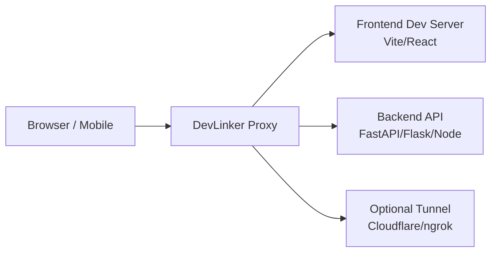

# Dev Linker

Dev Linker starts your local development stack and routes frontend and backend traffic through one proxy URL, with optional LAN and public sharing.

## ⚡ Quick Start (2 Minutes)

Install:

```bash
pip install devlinker
```

Run your apps:

```bash
# Backend (example)
uvicorn main:app --reload

# Frontend (example)
npm run dev
```

Run DevLinker:

```bash
devlinker
```

Open:

```text
http://localhost:8001
```

Done ✅

## 🧠 How DevLinker Works

Request flow:

```text
Browser -> DevLinker Proxy -> Frontend or Backend
```

Routing rules:

- / routes to frontend (React/Vite)
- /api/* routes to backend (FastAPI/Flask/Node)

DevLinker acts as a smart proxy and optional tunnel layer for local, LAN, and public development links.

Architecture diagram:



## 🎯 Use Cases

- Test APIs and UI flows on mobile devices over WLAN
- Share local work instantly with teammates using one public URL
- Debug frontend-backend integration from a single entrypoint
- Reduce CORS/preflight issues during development

## 🖼️ Demo & Screenshots

- Terminal startup output: add screenshot at docs/images/terminal-startup.png
- Browser app via proxy: add screenshot at docs/images/browser-proxy.png
- Public URL share demo: add screenshot at docs/images/public-url.png


## Features

- 🚀 **Unified Dev Proxy:** Combines frontend (Vite/React) and backend (FastAPI/Flask/Node/Docker) into a single local and public URL.
- 🔍 **Auto Detection:** Detects frontend/backend ports, runtime, Docker containers, and Vite servers automatically.
- 📡 **Debug Request Logger:** Live API traffic lines (method, path, status, latency) only in debug mode.
- 🧩 **Backend-Only Mode:** If no frontend is detected, DevLinker still runs and forwards all traffic to backend.
- 🔁 **Auto API URL Sync:** Updates `frontend/.env.local` with `VITE_API_URL=http://localhost:<proxy-port>` using a managed block.
- 🛡️ **Proxy CORS + Preflight:** Handles common CORS/preflight behavior at the proxy layer, including credential-safe Origin handling.
- 🧠 **Smart Detection & Doctor:** Real-time request analysis, backend intelligence, log analyzer, and `devlinker doctor` for instant diagnostics.
- 🛡️ **Auto-Fix Engine:** `devlinker fix` applies safe fixes (like VITE_API_URL) and suggests code changes.
- 🌍 **Public Sharing:** Share your local dev environment instantly with `--url` (startup) or `devlinker share` (runtime, no restart).
- 🔄 **Dynamic Tunnel Control:** `devlinker unshare` disables public tunnel at runtime.
- 📡 **WLAN Sharing:** Prints LAN URL for same-network device access.
- 🔒 **Secure Token Linking:** Optional token gate for LAN/public access with `DEVLINKER_LINK_TOKEN`.
- 📊 **Browser API Logs Dashboard:** Open `/__devlinker/dashboard` for lightweight live API visibility.
- 🧑‍💻 **Interactive CLI:** Modern, colorized, emoji-rich terminal UX for all commands.
- 🧩 **Zero Config:** Works out-of-the-box for most FastAPI, Flask, Vite, and Docker projects.
- 🧪 **Runtime Smoke Test:** Built-in test for end-to-end proxy validation.
- 🛠️ **Extensible:** Modular architecture for future SaaS, dashboard, and team features.

## Support DevLinker

If DevLinker helps you ship faster, consider supporting the project:

> 💖 Support DevLinker
> [](upi://pay?pa=devlinker@upi&pn=DevLinker&cu=INR&tn=Support%20DevLinker%20Project%20🚀)
> [](upi://pay?pa=devlinker@upi&pn=DevLinker&cu=INR&tn=Support%20DevLinker%20Project%20🚀)

- 💖 UPI: devlinker@upi
- 🔗 UPI link: upi://pay?pa=devlinker@upi&pn=DevLinker&cu=INR&tn=Support%20DevLinker%20Project%20🚀

## CLI Commands & Options

- `devlinker` — Start proxy (local only, fast)
- `devlinker support` — Show UPI support QR code in terminal
- `devlinker --url` — Start with public tunnel (Cloudflare/ngrok)
- `devlinker share` — Enable public tunnel at runtime (no restart)
- `devlinker unshare` — Disable public tunnel at runtime
- `devlinker doctor` — Diagnose issues, see categorized problems and fixes
- `devlinker fix` — Auto-fix common issues (env, API paths, config)
- `devlinker --frontend 5173 --backend 5000` — Override detected ports
- `devlinker --docker` — Auto-start Docker backend
- `devlinker --no-tunnel` — Force local-only mode
- `devlinker --no-lan` — Hide WLAN sharing URL
- `devlinker --interactive-backend` — Prompt to choose backend if multiple found
- `devlinker --proxy-port 18000` — Use custom proxy port
- `devlinker --debug` — Enable debug mode (turns on live API request logger)
- `devlinker --version` — Show version

Security token (optional):

```bash
set DEVLINKER_LINK_TOKEN=your-secret-token
devlinker --url
```

When enabled, LAN/public requests must include one of:
- query param `dl_token=...`
- header `X-DevLinker-Token: ...`
- header `Authorization: Bearer ...`

Built-in API logs dashboard:

```text
http://localhost:<proxy-port>/__devlinker/dashboard
```

JSON stream endpoint used by the dashboard:

```text
http://localhost:<proxy-port>/__devlinker/logs
```

## Project Structure

```text
devlinker/
├── devlinker/
│   ├── __init__.py
│   ├── main.py
│   ├── runner.py
│   ├── detector.py
│   ├── proxy.py
│   └── tunnel.py
├── setup.py
├── README.md
└── requirements.txt
```

## Install

For local development:

```bash
pip install .
```

For editable local development:

```bash
pip install -e .
```

After publishing to PyPI:

```bash
pip install devlinker
```

## Run

```bash
devlinker
```

Direct module run (without installing entrypoint script):

```bash
python -m devlinker.main
```

Typical startup output (TTY with Rich available):

```text
╭─────────────────────────────╮
│ ♾️  DevLinker v1.4.1        │
│ Smart Local Dev Environment │
╰─────────────────────────────╯

✔ Detecting project...
⏳ Booting local services...

╭───────── DevLinker Ready ─────────╮
│ Proxy     http://localhost:8001   │
│ WLAN      http://192.168.1.3:8001 │
│ Public    disabled (use --url)    │
╰───────────────────────────────────╯

✨ Ready in 5.5s
Powered by DevLinker 🚀
```

Enable debug mode with live API request logging:

```bash
devlinker --debug
```

Debug mode request logger sample:

```text
🛠 Debug mode enabled: live API request logger is ON

📡 Requests (Live)
GET    /api/users               200  45ms
POST   /api/login               401  120ms
```

Version check:

```bash
devlinker --version
```

Optional overrides:

```bash
devlinker --frontend 5173 --backend 5000
```

Backend override alias:

```bash
devlinker --backend-port 3001
```

Enable Docker auto-start explicitly:

```bash
devlinker --docker
```


## Tunnel and Sharing Modes

By default, DevLinker starts **fast local proxy only** (no tunnel). To enable a public tunnel, use the `--url` flag:


```bash
devlinker --url
```

This will start the proxy and open a public tunnel (Cloudflare or ngrok). The output will show:

```text
🌍 Enabling public tunnel...
✔ Tunnel provider: Cloudflare
✔ Public URL:
     https://xxxx.trycloudflare.com
ℹ Tip: Ctrl+Click to open link
ℹ Share this link with collaborators.
```

To force tunnel off (even if --url is passed):

```bash
devlinker --no-tunnel
```

When running without `--url`, you’ll see:

```text
⚡ Skipping public tunnel (use --url to enable)

💡 Need to share outside network?
👉 Run: devlinker --url
```

Disable WLAN URL output:

```bash
devlinker --no-lan
```
## Smart Detection & Auto-Fix System

DevLinker now includes an AI-powered detection and auto-fix engine:

- **Request Inspector:** Real-time analysis of proxy traffic for common mistakes (missing `/api` prefix, 404s, CORS risks, upstream failures)
- **Backend Intelligence:** Probes backend endpoints and type at startup for smarter routing and hints
- **Log Analyzer:** Converts error messages (CORS, 404, connection refused) into human-readable explanations and actionable fixes
- **Smart Warning Engine:** Prints clean CLI warnings and suggestions, e.g.:

```text
⚠️  Detected direct backend call (localhost:5000)
👉 Use /api/* instead of direct URL
```

All detection and fixes are modular, async-compatible, and production-ready. See `devlinker/proxy.py`, `devlinker/detector_ai.py`, and `devlinker/logger.py` for implementation.

Interactive backend selection (when local and Docker are both detected):

```bash
devlinker --interactive-backend
```

Disable interactive backend selection (keeps local-first behavior):

```bash
devlinker --no-interactive-backend
```

If port 8000 is already in use:

```bash
devlinker --frontend 5173 --backend 5000 --proxy-port 18000
```

Default behavior also tries fallback ports automatically when 8000 is busy:

```text
⚠ Port 8000 in use
ℹ Using proxy port: 8001
```

By default it scans the next 10 ports after the requested one, then tries `18000`.

Frontend detection behavior:

- Scans Vite defaults and fallback ports (`5173` through `5190`)
- Also checks common alternatives (`3000`, `4173`, `8080`)
- Retries during startup to catch slow boot cases
- Performs readiness gating before proxy startup (waits until frontend looks like Vite and backend responds)

## Important Frontend Rule

Frontend requests must use relative API paths:

```js
fetch("/api/endpoint")
```

Do not hardcode backend host URLs in frontend code.

DevLinker also writes/updates a managed block in `frontend/.env.local`:

```env
# devlinker-managed:start
VITE_API_URL=http://localhost:8001
# devlinker-managed:end
```

This keeps frontend API calls consistently routed through the proxy.

Use the proxy URL as your single entry point during development:

```text
http://localhost:<proxy-port>
```

Avoid direct backend calls like `http://localhost:5000` from browser-facing code.

## Configuration File

DevLinker loads config from the first file found in this order:

1. `devlinker.yaml`
2. `devlinker.yml`
3. `devlinker.json`

Example:

```yaml
frontend: 5173
backend: 5000
proxy_port: 8001
tunnel: false
```

## Backend Auto-Detection

Backend port detection runs in this order:

1. Check localhost port 5000
2. If not found, query Docker via Docker SDK (`docker.from_env()`) for published host-to-container port mappings
3. Prioritize containers using labels when present (`devlinker.role=backend`, optional `devlinker.port=<container-port>`)
4. Otherwise rank containers by likely backend identity (name hints like backend/api plus project-name hints)
5. Use the best mapped host port automatically, even when internal port is not 5000
6. If nothing is found, print next-step guidance and exit

If Docker SDK is unavailable, Dev Linker falls back to Docker CLI parsing as a compatibility path.

When both Local and Docker backends are available, Dev Linker prompts you to choose one (TTY mode) unless `--no-interactive-backend` is used.

If backend detection fails, Dev Linker prints a clear checklist showing what it checked and how to recover.

Detection messages include source labels, for example:

```text
[OK] Backend detected (Local) -> port 5000
```

Example Docker dynamic-port message:

```text
[WARN] Backend not found on port 5000
[INFO] Checking Docker containers...
[OK] Backend detected (Docker) -> port 32768
```

Dev Linker checks backend runtime in this order:

1. Docker Compose (`backend/docker-compose.yml`, `docker-compose.yaml`, `compose.yml`, or `compose.yaml`)
2. Docker (`backend/Dockerfile`)
3. Node (`backend/package.json`)
4. Python (`backend/requirements.txt` or `backend/app.py`)

Backend startup commands:

- Docker Compose (default): manual run `docker compose up --build` in `backend/`
- Dockerfile (default): manual run `docker build -t devlinker-backend .` then `docker run --rm -p 5000:5000 devlinker-backend`
- Docker Compose/Dockerfile with `--docker`: Dev Linker runs those Docker commands for you
- Node: `npm run dev` (or `npm start` when `dev` is missing)
- Python: `python app.py`

For containerized Flask backends, ensure:

- App binds to all interfaces: `app.run(host="0.0.0.0", port=5000)`
- Port mapping is present: `-p 5000:5000`

## Notes

- runner.py expects frontend project in frontend and Python app in backend/app.py.
- If those paths do not exist, Dev Linker skips launch and only tries to detect already-running services.
- If frontend is missing but backend is available, DevLinker continues in backend-only mode.
- Tunnel selection order is: cloudflared (TryCloudflare), then ngrok.
- If cloudflared is unavailable and ngrok is not configured, Dev Linker prints one-time setup guidance.
- You may need to set ngrok auth once on your machine using ngrok config add-authtoken <token>.
- Dev Linker prints a public URL with `ngrok-skip-browser-warning=true` only when ngrok is used.
- Startup output includes selected tunnel provider (`cloudflare` or `ngrok`).
- Proxy layer now supports WebSocket upgrades, including Vite HMR over shared links.
- Proxy handles common CORS/preflight behavior and adds camera/mic permissions policy headers.
- Live API request logging is disabled by default and only enabled with `devlinker --debug`.
- Proxy listens on `0.0.0.0` and can print a WLAN URL for same-network sharing.
- If WLAN access fails on Windows, allow the proxy port in firewall and confirm devices are on the same network.

## Runtime Smoke Test

Run this test to validate proxy behavior end-to-end (frontend HTTP route, backend API forwarding, and WebSocket pass-through):

```bash
python -m unittest tests.test_proxy_runtime
```

The test spins up lightweight local frontend and backend apps, starts Dev Linker proxy, and verifies:

- `GET /` is routed to frontend
- `POST /api/login` is routed to backend
- `ws://.../hmr` round-trip works through proxy

## Troubleshooting Links

If local or shared links show blank pages, connection refused errors, or 404s, check these common causes:

1. Docker backend binding

- Symptom: `http://localhost:<backend-port>` refuses connection.
- Cause: backend process inside container is bound to `127.0.0.1` instead of `0.0.0.0`.
- Fix: run backend with host `0.0.0.0` (example FastAPI/Uvicorn: `uvicorn app.main:app --host 0.0.0.0 --port 8000`).

2. API prefix mismatch

- Symptom: frontend loads through Dev Linker but API calls return 404.
- Cause: frontend calls `/api/...`, but backend routes are mounted without `/api` prefix.
- Fix: expose backend routes under `/api` (or adjust frontend paths to match backend routes).

3. Vite host restrictions

- Symptom: direct Vite URL works, Dev Linker proxy URL is blank or blocked.
- Cause: Vite host protections reject proxied host/port.
- Fix: set Vite `server.host` and `server.allowedHosts` to allow proxy use.

Quick isolate sequence:

1. Open `http://localhost:<backend-port>/docs` (or `/health`) directly.
2. Open Dev Linker local proxy URL and verify UI loads.
3. Use browser network tab to check API status codes for `/api/*` requests.

## Real-Time Development

- Run `devlinker` to share one combined frontend/backend URL.
- Vite HMR and other WebSocket flows are proxied end-to-end through Dev Linker.
- Keep using relative frontend API paths (for example, `/api/endpoint`) so routing stays consistent locally and over tunnel.
